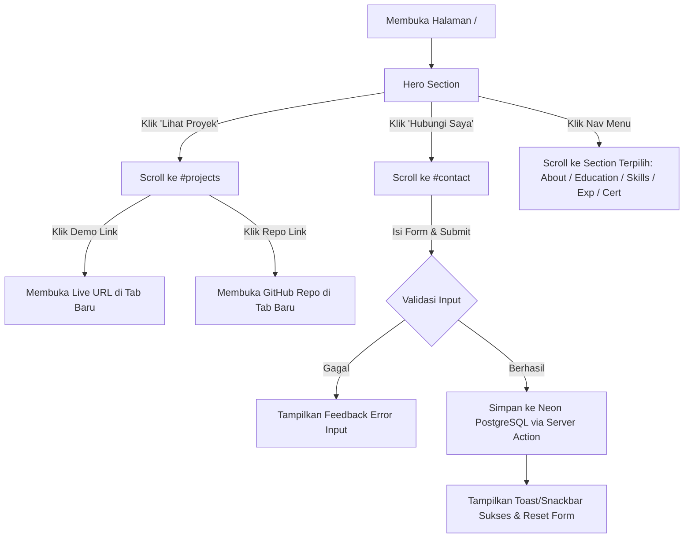
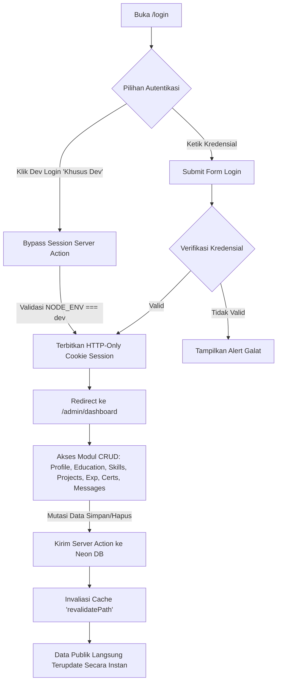

# 03 - Information Architecture (IA) & Routing

## 1. Ikhtisar Arsitektur Informasi
Arsitektur Informasi (IA) ini memetakan bagaimana data, halaman, modul administrasi, dan sistem navigasi diorganisasikan dalam platform portofolio Muhammad Fauzan Al Hafizh. Pendekatan arsitektur ini membagi sistem secara tegas menjadi dua ranah utama:
1. **Public Showcase Domain:** Mengutamakan pengalaman penjelajahan mulus (*seamless single-page navigation* dengan anchor sections, dipadukan dengan rute detail jika diperlukan).
2. **Admin Management Domain (CMS):** Mengutamakan struktur dashboard analitik dan tata kelola data berbasis tabel/kartu (*enterprise-grade dashboard shell* dengan *collapsible drawer*, *topbar*, dan *modal dialogs*).

---

## 2. Struktur Sitemap & Hirarki URL

```
[Portofolio Root]
│
├── Public Portal (Route Group: (public))
│   └── / .................................... Halaman Utama (One-Page Showcase)
│       ├── #hero ............................ Hero Section & Headline
│       ├── #about ........................... Ringkasan Profil, Bio & Resume
│       ├── #education ....................... Linimasa Pendidikan
│       ├── #skills .......................... Matriks Keterampilan per Kategori
│       ├── #projects ........................ Galeri Proyek Unggulan
│       ├── #experience ...................... Linimasa Riwayat Pengalaman
│       ├── #certificates .................... Etalase Sertifikasi & Kredensial
│       └── #contact ......................... Formulir Pesan & Informasi Kontak
│
├── Authentication (Route Group: (auth))
│   └── /login ............................... Halaman Autentikasi Admin (+ Dev Login Button)
│
└── Admin Management CMS (Route Group: (admin)) [Protected by Middleware]
    └── /admin
        ├── /dashboard ....................... Metrik Statistik, Ringkasan, Aktivitas Terkini
        ├── /profile ......................... Manajemen Data Profil, Bio, & Media Sosial
        ├── /education ....................... CRUD Riwayat Pendidikan
        ├── /skills .......................... CRUD Daftar Keterampilan & Kategori
        ├── /projects ........................ CRUD Portofolio Proyek & Tag Teknologi
        ├── /experience ...................... CRUD Pengalaman Kerja & Organisasi
        ├── /certificates .................. CRUD Sertifikat & Lisensi
        └── /messages ........................ Manajemen Pesan Masuk & Detail Kotak Masuk
```

---

## 3. Struktur Layout & Route Groups (Next.js App Router)

### 3.1. Route Group `(public)`
* **Layout File:** `src/app/(public)/layout.tsx`
* **Elemen Pembentuk:**
  * **Top Navigation Bar:** Sticky dengan latar belakang kaca (*frosted glassmorphism* `backdrop-blur-md`), memuat nama/logo personal "Fauzan Al Hafizh", tautan navigasi desktop, tombol Dark/Light mode, dan tombol pemicu menu mobile (*hamburger icon*).
  * **Mobile Navigation Drawer (Vuetify-style):** Drawer yang meluncur halus dari sisi kanan/kiri saat tombol menu ditekan pada layar ponsel, berisi daftar navigasi vertikal berikon Font Awesome dan tombol aksi cepat.
  * **Main Content Area:** Kontainer utama dengan padding yang proporsional dan transisi section yang teratur.
  * **Public Footer:** Memuat penegasan hak cipta, tautan media sosial eksternal berikon Font Awesome, tautan pintas navigasi atas, dan status koneksi ke backend.

### 3.2. Route Group `(auth)`
* **Layout File:** `src/app/(auth)/layout.tsx`
* **Karakteristik:**
  * Bebas dari navbar dan footer publik agar fokus pengguna terarah penuh pada proses autentikasi.
  * Latar belakang bersih dengan aksen geometris lembut / ambient glow.
  * Kartu form login terpusat (*centered card*) dengan elevasi Vuetify `elevation-4` dan radius proporsional.

### 3.3. Route Group `(admin)`
* **Layout File:** `src/app/(admin)/admin/layout.tsx`
* **Elemen Pembentuk:**
  * **Admin Navigation Drawer / Sidebar:**
    * Menyediakan daftar menu navigasi berikon Font Awesome untuk seluruh 8 modul (Dashboard, Profile, Education, Skills, Projects, Experience, Certificates, Messages).
    * Mendukung mode ekspansi (*expanded* lebar 260px) dan mode ringkas (*collapsed* lebar 72px) pada layar desktop.
    * Mengadopsi perilaku overlay drawer pada layar mobile (< 1024px).
    * Menampilkan lencana (*badge*) jumlah pesan kontak yang belum dibaca pada menu "Messages".
  * **Admin Topbar:**
    * Tombol toggle collapse sidebar.
    * Breadcrumbs yang menunjukkan hierarki halaman yang sedang aktif.
    * Tombol pintas "Lihat Website Publik" (*opens in new tab* atau direct link).
    * Dropdown profil administrator dengan tombol "Keluar / Logout".
  * **Admin Content Container:**
    * Area kerja dinamis dengan *page title*, *action bar* (e.g. tombol "Tambah Baru"), *data tables*, *filter controls*, dan *pagination*.

---

## 4. Alur Interaksi Pengguna (User Navigation Flows)

### 4.1. Alur Pengunjung Publik (Public User Journey)


### 4.2. Alur Pengguna Administrator (Admin Journey)


---

## 5. Matriks Relasi Antarhalaman & Struktur Data yang Ditampilkan

| Rute Halaman | Entitas Data Terkait | Komponen Tampilan Utama | Aksi Utama Pengguna |
| :--- | :--- | :--- | :--- |
| **`/` (#hero)** | `profiles` | `HeroSection`, `AvailabilityBadge`, `SocialLinks` | Scroll CTA, Klik Social Media |
| **`/` (#about)** | `profiles` | `AboutCard`, `BioContent`, `ResumeDownloadButton` | Baca Bio, Unduh Resume |
| **`/` (#education)** | `educations` | `EducationTimeline`, `EducationCard` | Telusuri riwayat akademik |
| **`/` (#skills)** | `skills` | `SkillCategoryTabs`, `SkillCard`, `ProficiencyBar` | Filter kategori skill |
| **`/` (#projects)** | `projects` | `ProjectGrid`, `ProjectCard`, `TechBadge` | Filter tag, buka demo, buka repo |
| **`/` (#experience)**| `experiences` | `ExperienceTimeline`, `ExperienceCard` | Telusuri riwayat profesional |
| **`/` (#certificates)`**| `certificates` | `CertificateGrid`, `CertificateCard` | Buka link verifikasi kredensial |
| **`/` (#contact)** | `contact_messages` | `ContactForm`, `ContactInfoCard`, `Snackbar` | Kirim pesan ke database |
| **`/login`** | `admin_users` | `LoginFormCard`, `DevLoginButton` | Autentikasi sesi admin |
| **`/admin/dashboard`**| Seluruh Entitas | `MetricSummaryCards`, `RecentMessagesWidget` | Tinjau analitik ringkas |
| **`/admin/profile`** | `profiles` | `ProfileEditForm`, `AvatarUploaderInput` | Perbarui data pribadi & tautan |
| **`/admin/education`**| `educations` | `DataTable`, `EducationFormDialog`, `DeleteDialog` | Tambah/Edit/Hapus riwayat studi |
| **`/admin/skills`** | `skills` | `DataTable`, `SkillFormDialog`, `OrderControl` | Tambah/Edit/Hapus keterampilan |
| **`/admin/projects`** | `projects` | `DataTable`, `ProjectFormDialog`, `TechTagInput` | Tambah/Edit/Hapus proyek portofolio |
| **`/admin/experience`**| `experiences` | `DataTable`, `ExperienceFormDialog`, `DateRange` | Tambah/Edit/Hapus riwayat kerja |
| **`/admin/certificates`**| `certificates` | `DataTable`, `CertificateFormDialog` | Tambah/Edit/Hapus sertifikat |
| **`/admin/messages`** | `contact_messages` | `DataTable`, `MessageDetailDialog`, `MarkReadBtn` | Baca pesan, hapus pesan spam |

---

## 6. Arsitektur State Navigasi & Responsif
* **Active Navigation State:** Menggunakan *Intersection Observer API* pada halaman publik untuk mendeteksi section mana yang saat ini terlihat di *viewport*, secara otomatis memberikan highlight aktif pada menu navbar yang sesuai.
* **Scroll Behavior:** Menerapkan CSS `scroll-behavior: smooth` dan offset penyesuaian tinggi navbar (`scroll-margin-top: 80px`) agar saat tautan anchor diklik, judul section tidak terpotong oleh navbar tetap.
* **Mobile Drawer Transitions:** Animasi pembukaan drawer navigasi menggunakan durasi 250ms ease-out dengan overlay semi-transparan `backdrop-blur-sm`, memastikan transisi yang tidak membebani kartu grafis ponsel.
