# 06 - Database Schema & Data Models (Drizzle ORM & Neon PostgreSQL)

## 1. Ikhtisar Model Data
Basis data dirancang di atas engine **Neon PostgreSQL** menggunakan **Drizzle ORM**. Skema dinormalisasi secara terstruktur untuk menjamin integritas data, mendukung penyusunan indeks yang optimal, serta memberikan fleksibilitas pengelolaan konten secara dinamis melalui Admin Panel.

```mermaid
erDiagram
    ADMIN_USERS {
        uuid id PK
        varchar username UK
        varchar email UK
        text password_hash
        timestamp created_at
        timestamp updated_at
    }

    PROFILES {
        uuid id PK
        varchar full_name
        varchar headline
        text bio
        text avatar_url
        text resume_url
        varchar location
        varchar email
        varchar phone
        varchar github_url
        varchar linkedin_url
        varchar whatsapp_url
        boolean is_available
        timestamp updated_at
    }

    EDUCATIONS {
        uuid id PK
        varchar institution
        varchar degree
        varchar field_of_study
        date start_date
        date end_date
        boolean is_current
        text description
        integer order_index
        boolean is_published
        timestamp created_at
        timestamp updated_at
    }

    SKILLS {
        uuid id PK
        varchar name
        varchar category
        varchar icon_class
        integer proficiency_level
        integer order_index
        boolean is_published
        timestamp created_at
        timestamp updated_at
    }

    PROJECTS {
        uuid id PK
        varchar title
        varchar slug UK
        text description
        text content
        text thumbnail_url
        jsonb technologies
        text demo_url
        text repo_url
        boolean is_featured
        integer order_index
        boolean is_published
        timestamp created_at
        timestamp updated_at
    }

    EXPERIENCES {
        uuid id PK
        varchar company
        varchar role
        varchar employment_type
        varchar location
        date start_date
        date end_date
        boolean is_current
        text description
        integer order_index
        boolean is_published
        timestamp created_at
        timestamp updated_at
    }

    CERTIFICATES {
        uuid id PK
        varchar title
        varchar issuer
        date issue_date
        date expiration_date
        varchar credential_id
        text credential_url
        text image_url
        integer order_index
        boolean is_published
        timestamp created_at
        timestamp updated_at
    }

    CONTACT_MESSAGES {
        uuid id PK
        varchar name
        varchar email
        varchar subject
        text message
        boolean is_read
        timestamp created_at
    }
```

---

## 2. Rincian Spesifikasi Tabel (Drizzle ORM Definition)

### 2.1. Tabel `admin_users`
Menyimpan akun administrator terautentikasi.
| Nama Kolom | Tipe Data | Constraint / Default | Deskripsi |
| :--- | :--- | :--- | :--- |
| `id` | `uuid` | Primary Key, `defaultRandom()` | Pengenal unik administrator |
| `username` | `varchar(50)` | Not Null, Unique | Nama pengguna untuk login |
| `email` | `varchar(255)` | Not Null, Unique | Email administrator |
| `password_hash` | `text` | Not Null | Hash password hasil enkripsi bcrypt |
| `created_at` | `timestamp` | Not Null, `defaultNow()` | Waktu pembuatan akun |
| `updated_at` | `timestamp` | Not Null, `defaultNow()` | Waktu pembaruan akun |

### 2.2. Tabel `profiles`
Menyimpan data identitas pribadi dan pengenalan Muhammad Fauzan Al Hafizh (Single-row configuration).
| Nama Kolom | Tipe Data | Constraint / Default | Deskripsi |
| :--- | :--- | :--- | :--- |
| `id` | `uuid` | Primary Key, `defaultRandom()` | Pengenal unik profil |
| `full_name` | `varchar(150)` | Not Null, Default: 'Muhammad Fauzan Al Hafizh' | Nama lengkap pemilik |
| `headline` | `varchar(255)` | Not Null | Headline profesional (e.g. Full-Stack Engineer) |
| `bio` | `text` | Not Null | Deskripsi diri lengkap / filosofi koding |
| `avatar_url` | `text` | Nullable | URL foto profil |
| `resume_url` | `text` | Nullable | URL dokumen CV/Resume (PDF) |
| `location` | `varchar(100)` | Nullable | Lokasi domisili |
| `email` | `varchar(255)` | Nullable | Alamat email publik untuk kontak |
| `phone` | `varchar(50)` | Nullable | Nomor telepon kontak |
| `github_url` | `text` | Nullable | Tautan ke profil GitHub |
| `linkedin_url`| `text` | Nullable | Tautan ke profil LinkedIn |
| `whatsapp_url`| `text` | Nullable | Tautan direct WhatsApp chat |
| `is_available`| `boolean` | Not Null, Default: `true` | Status "Open to Work / Available" |
| `updated_at` | `timestamp` | Not Null, `defaultNow()` | Waktu pembaruan profil |

### 2.3. Tabel `educations`
Menyimpan riwayat pendidikan formal dan non-formal.
| Nama Kolom | Tipe Data | Constraint / Default | Deskripsi |
| :--- | :--- | :--- | :--- |
| `id` | `uuid` | Primary Key, `defaultRandom()` | ID entitas pendidikan |
| `institution` | `varchar(200)` | Not Null | Nama universitas / sekolah |
| `degree` | `varchar(100)` | Not Null | Gelar akademik (e.g. Sarjana Komputer) |
| `field_of_study`| `varchar(150)` | Not Null | Jurusan / Program Studi |
| `start_date` | `date` | Not Null | Tanggal / tahun mulai |
| `end_date` | `date` | Nullable | Tanggal selesai (null jika masih berjalan) |
| `is_current` | `boolean` | Not Null, Default: `false` | Status sedang menempuh studi |
| `description` | `text` | Nullable | Catatan prestasi / skripsi / kegiatan |
| `order_index` | `integer` | Not Null, Default: `0` | Urutan penataan tampilan |
| `is_published` | `boolean` | Not Null, Default: `true` | Sakelar visibilitas di halaman publik |
| `created_at` | `timestamp` | Not Null, `defaultNow()` | Waktu pembuatan entitas |
| `updated_at` | `timestamp` | Not Null, `defaultNow()` | Waktu pembaruan entitas |

### 2.4. Tabel `skills`
Menyimpan daftar kemampuan teknis dan alat pengembangan.
| Nama Kolom | Tipe Data | Constraint / Default | Deskripsi |
| :--- | :--- | :--- | :--- |
| `id` | `uuid` | Primary Key, `defaultRandom()` | ID entitas keahlian |
| `name` | `varchar(100)` | Not Null | Nama keahlian (e.g. Next.js, PostgreSQL) |
| `category` | `varchar(100)` | Not Null | Kategori (Frontend, Backend, DB, DevOps, Tools) |
| `icon_class` | `varchar(100)` | Not Null | Ikon Font Awesome (e.g. `fa-brands fa-react`) |
| `proficiency_level`| `integer` | Default: `85` | Tingkat kemahiran (skala 1 - 100) |
| `order_index` | `integer` | Not Null, Default: `0` | Urutan penataan |
| `is_published` | `boolean` | Not Null, Default: `true` | Sakelar tampil/sembunyi |
| `created_at` | `timestamp` | Not Null, `defaultNow()` | Waktu pembuatan entitas |
| `updated_at` | `timestamp` | Not Null, `defaultNow()` | Waktu pembaruan entitas |

### 2.5. Tabel `projects`
Menyimpan katalog karya dan proyek rekayasa perangkat lunak.
| Nama Kolom | Tipe Data | Constraint / Default | Deskripsi |
| :--- | :--- | :--- | :--- |
| `id` | `uuid` | Primary Key, `defaultRandom()` | ID entitas proyek |
| `title` | `varchar(200)` | Not Null | Judul proyek |
| `slug` | `varchar(220)` | Not Null, Unique | Slug URL ramah SEO |
| `description` | `text` | Not Null | Ringkasan singkat proyek |
| `content` | `text` | Nullable | Deskripsi mendalam / fitur utama (Markdown) |
| `thumbnail_url`| `text` | Nullable | URL gambar pratinjau proyek |
| `technologies` | `jsonb` | Not Null, Default: `'[]'` | Array tag teknologi (e.g. `["Next.js", "Neon"]`) |
| `demo_url` | `text` | Nullable | Tautan ke live demo |
| `repo_url` | `text` | Nullable | Tautan ke repositori GitHub |
| `is_featured` | `boolean` | Not Null, Default: `false` | Penanda proyek sorotan utama |
| `order_index` | `integer` | Not Null, Default: `0` | Urutan kartu pada grid |
| `is_published` | `boolean` | Not Null, Default: `true` | Status publikasi |
| `created_at` | `timestamp` | Not Null, `defaultNow()` | Waktu pembuatan entitas |
| `updated_at` | `timestamp` | Not Null, `defaultNow()` | Waktu pembaruan entitas |

### 2.6. Tabel `experiences`
Menyimpan riwayat karier, pekerjaan, magang, dan peran profesional.
| Nama Kolom | Tipe Data | Constraint / Default | Deskripsi |
| :--- | :--- | :--- | :--- |
| `id` | `uuid` | Primary Key, `defaultRandom()` | ID entitas pengalaman |
| `company` | `varchar(200)` | Not Null | Nama instansi / perusahaan |
| `role` | `varchar(150)` | Not Null | Posisi / jabatan |
| `employment_type`| `varchar(50)`| Not Null, Default: 'Full-time' | Tipe pekerjaan (Full-time, Contract, Internship) |
| `location` | `varchar(100)` | Nullable | Lokasi (e.g. Jakarta, Indonesia / Remote) |
| `start_date` | `date` | Not Null | Tanggal mulai bekerja |
| `end_date` | `date` | Nullable | Tanggal selesai (null jika masih bekerja) |
| `is_current` | `boolean` | Not Null, Default: `false` | Status posisi saat ini |
| `description` | `text` | Not Null | Tanggung jawab dan pencapaian |
| `order_index` | `integer` | Not Null, Default: `0` | Urutan urutan linimasa |
| `is_published` | `boolean` | Not Null, Default: `true` | Status publikasi |
| `created_at` | `timestamp` | Not Null, `defaultNow()` | Waktu pembuatan entitas |
| `updated_at` | `timestamp` | Not Null, `defaultNow()` | Waktu pembaruan entitas |

### 2.7. Tabel `certificates`
Menyimpan sertifikasi resmi, kursus terakreditasi, dan lisensi kompetensi.
| Nama Kolom | Tipe Data | Constraint / Default | Deskripsi |
| :--- | :--- | :--- | :--- |
| `id` | `uuid` | Primary Key, `defaultRandom()` | ID entitas sertifikat |
| `title` | `varchar(200)` | Not Null | Nama sertifikat |
| `issuer` | `varchar(150)` | Not Null | Lembaga penerbit (e.g. AWS, Dicoding, Coursera) |
| `issue_date` | `date` | Not Null | Tanggal sertifikat terbit |
| `expiration_date`| `date` | Nullable | Tanggal kadaluarsa jika memiliki masa berlaku |
| `credential_id`| `varchar(150)` | Nullable | ID verifikasi resmi |
| `credential_url`| `text` | Nullable | Tautan online untuk verifikasi keaslian |
| `image_url` | `text` | Nullable | URL gambar sertifikat atau logo penerbit |
| `order_index` | `integer` | Not Null, Default: `0` | Urutan tampilan |
| `is_published` | `boolean` | Not Null, Default: `true` | Status publikasi |
| `created_at` | `timestamp` | Not Null, `defaultNow()` | Waktu pembuatan entitas |
| `updated_at` | `timestamp` | Not Null, `defaultNow()` | Waktu pembaruan entitas |

### 2.8. Tabel `contact_messages`
Menampung seluruh pesan yang dikirimkan oleh pengunjung melalui formulir kontak.
| Nama Kolom | Tipe Data | Constraint / Default | Deskripsi |
| :--- | :--- | :--- | :--- |
| `id` | `uuid` | Primary Key, `defaultRandom()` | ID unik pesan |
| `name` | `varchar(150)` | Not Null | Nama lengkap pengirim pesan |
| `email` | `varchar(255)` | Not Null | Alamat email pengirim |
| `subject` | `varchar(255)` | Not Null | Judul atau perihal pesan |
| `message` | `text` | Not Null | Isi teks pesan lengkap |
| `is_read` | `boolean` | Not Null, Default: `false` | Penanda status pesan telah dibaca admin |
| `created_at` | `timestamp` | Not Null, `defaultNow()` | Waktu pengiriman pesan |

---

## 3. Strategi Indexing & Optimasi Query
Untuk memastikan query halaman publik berjalan secepat kilat tanpa full-table scan, disusun indeks komposit berikut:
1. `idx_projects_pub_order`: `ON projects(is_published, order_index)`
2. `idx_skills_pub_cat_order`: `ON skills(is_published, category, order_index)`
3. `idx_experiences_pub_order`: `ON experiences(is_published, order_index)`
4. `idx_educations_pub_order`: `ON educations(is_published, order_index)`
5. `idx_certificates_pub_order`: `ON certificates(is_published, order_index)`
6. `idx_contact_messages_read`: `ON contact_messages(is_read, created_at DESC)`
7. Unique Index: `projects(slug)`, `admin_users(username)`, `admin_users(email)`.

---

## 4. Alur Migrasi & Seeding Data Development

### 4.1. Eksekusi Migrasi Drizzle Kit
Skema dieksekusi secara deklaratif menggunakan perintah:
* `npx drizzle-kit push` (Menerapkan perubahan skema secara langsung ke database Neon PostgreSQL).

### 4.2. Kebijakan Seeding Data (Anti-Data Fiktif)
* **Aturan Mutlak:** Sistem tidak akan mengarang data pribadi, riwayat pendidikan palsu, atau riwayat kerja palsu untuk Muhammad Fauzan Al Hafizh.
* **Format Seeding Development (`src/db/seed.ts`):**
  * Akun admin development dibuat dengan username `hafizh` dan password development aman.
  * Data profil menggunakan nama resmi **Muhammad Fauzan Al Hafizh**, dengan placeholder jelas seperti `[ISI HEADLINE PROFESIONAL]`, `[ISI BIO LENGKAP]`, `[ISI LINK GITHUB]`, `[ISI LINK LINKEDIN]`.
  * Data sampel untuk Proyek, Pendidikan, Keterampilan, Pengalaman, dan Sertifikat secara transparan diberi label `[DATA CONTOH - DAPAT DIUBAH DI ADMIN PANEL]` sehingga memudahkan admin untuk segera menggantinya dengan portofolio riil setelah sistem aktif.
